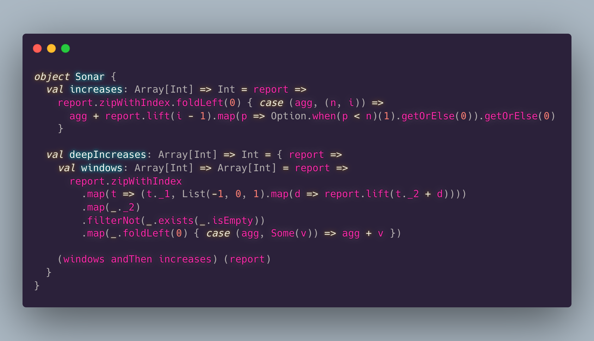
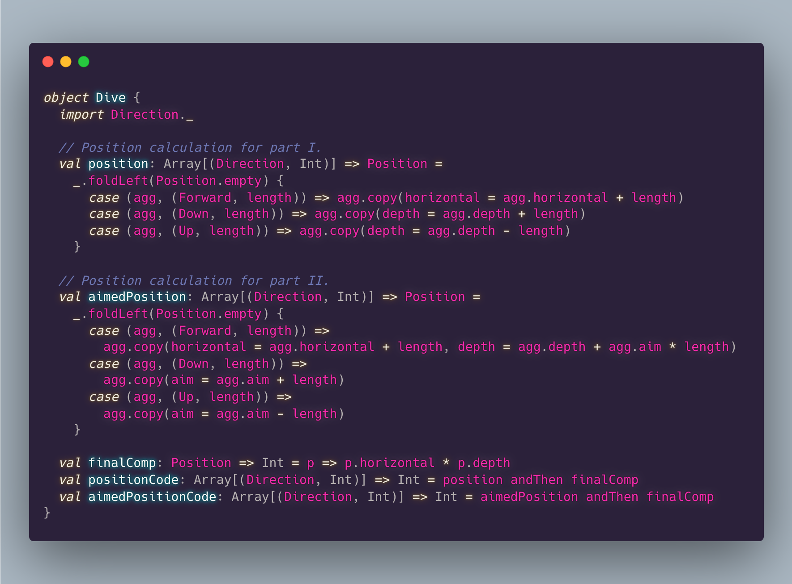
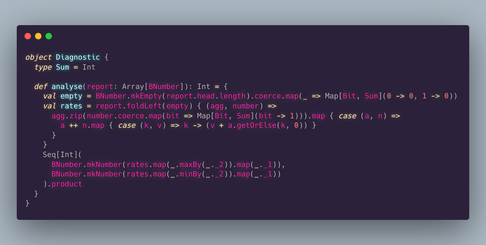

# Advent Of Code 2021

My solutions for [Advent Of Code **2021**][aoc] in [Scala](https://www.scala-lang.org/).

- [Oto Brglez](https://github.com/otobrglez)

## Development and test

```bash
sbt test # To run the whole test suite and all tests
sbt "testOnly com.pinkstack.aoc.day02.*" # For specific day/scenario
```

## Visualisations

### Day 01


### Day 02


### Day 03 - Part I.


### Day 04


[aoc]: https://adventofcode.com/
